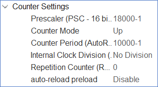

<div id="top"></div>

<!-- PROJECT SHIELDS -->
<!--
*** I'm using markdown "reference style" links for readability.
*** Reference links are enclosed in brackets [ ] instead of parentheses ( ).
*** See the bottom of this document for the declaration of the reference variables
*** for contributors-url, forks-url, etc. This is an optional, concise syntax you may use.
*** https://www.markdownguide.org/basic-syntax/#reference-style-links
-->

[![Instagram][instagram-shield]][instagram-url]
[![LinkedIn][linkedin-shield]][linkedin-url]
[![Github][github-shield]][github-url]  

<!-- PROJECT LOGO -->
<br />
<div align="center">
  <h3 align="center">TCP/IP Server & Client Example</h3>

  <p align="center">
    TCP/IP Server and Client Example without Memory Config on NUCLEO-F429ZI 
    <br />
    <a href="https://github.com/arslanalperen/TCP-IP-Server-Client"><strong>Explore the docs »</strong></a>
    <br />
    <br />
    <a href="https://github.com/arslanalperen/TCP-IP-Server-Client">View Demo</a>
    ·
    <a href="https://github.com/arslanalperen/TCP-IP-Server-Client/issues">Report Bug</a>
    ·
    <a href="https://github.com/arslanalperen/TCP-IP-Server-Client/issues">Request Feature</a>
  </p>
</div>

<!-- TABLE OF CONTENTS -->
<details>
  <summary>Table of Contents</summary>
  <ol>
    <li>
      <a href="#ethernet-setup">Ethernet Setup</a>
       <ul>
        <li><a href="#creating-a-project">Creating a Project</a></li>
        <li><a href="#clock-configuration">Clock Configuration</a></li>
        <li><a href="#timer-configuration">Timer Configuration</a></li>
        <li><a href="#ethernet-configuration">Ethernet Configuration</a></li>
        <li><a href="#lwip-configuration">LWIP Configuration</a></li>
      </ul>
    </li>
    <li>
      <a href="#software-setup">Software Setup</a>
      <ul>
        <li><a href="#tcp-server">TCP Server</a></li>
        <li><a href="#tcp-client">TCP Client</a></li>
      </ul>
    </li>
    <li>
      <a href="#ethernet-connection">Ethernet Connection</a>
      <ul>
        <li><a href="#tcp-server-connection">TCP Server Connection</a></li>
        <li><a href="#tcp-client-connection">TCP Client Connection</a></li>
      </ul>
    </li>
    <li><a href="#review">Review</a></li>
  </ol>
</details>

TCP/IP Server demo is installed on NUCLEO-F429ZI board. The purpose is to send dummy data to the Client at regular intervals over the TCP/IP Server device.

# Ethernet Setup

The mentioned configurations are also valid for TCP/IP Server and Client devices.

## Creating a Project

A new project should be created. `New` and `STM32 Project` options should be selected from the `File` section in the upper left corner. On the screen that appears, go to the `Board Selector` section and write `NUCLEO-F429ZI` in the `Commercial Part Number` section (Figure 1).

<div align="center">  </div>

A card is selected from the `Boards List` section, the project is named and created. Preferably the project should not be created with default settings. After the project is created, the ioc file of the project is opened. Again, preferably after the ioc file is opened, the `Clear Pinout` option should be selected from the `Pinout` section and the currently selected pinouts should be cleared.

## Clock Configuration

In order to set the clock of the card, the `RCC` screen is opened from the `System Core` section. `High Speed Clock (HSE)` option is selected as `Crystal/Ceramic Resonator`. The `Low Speed Clock (LSE)` option is kept off (Figure 2). While creating the demo, the clock settings were chosen in this way. The project can work with different clock settings.

<div align="center">  </div>

Go to the `Clock Configuration` section. `HCLK` option is preferred to be operated at maximum. It is set to 180 MHz. After the `Clock Configuration` part is set without any problems, the clock settings are completed.

<div align="center">  </div>

## Timer Configuration

Move to `Timer` category and select `TIM1`. Preferably `TIM1` is used. If desired, a different timer can be used. What is important at this point is which APB line the selected timer is connected to. `TIM1` is connected to APB2 line. If a different timer is to be used, it can be found to which APB line the selected timer is connected by examining the STM32F429ZI Reference Manual. For this, go to the `2.3 Memory Map` section in the Reference Manual. The `Bus` option written at the point where TIM1 is seen in the `Peripheral` part of the table indicates which APB line it is connected to.

<div align="center">  </div>

After selecting the `TIM1` option, the `Clock Source` option is selected as `Internal Clock` from the `Mode` section.

<div align="center">  </div>

Timer is requested to run at 1 second intervals. `Prescaler` and `Counter Period` should be set for 1 second in `Parameter Settings` section. The time interval during which the timer will operate is divided by the corresponding APB timer clock value `Prescaler`. The result is also divided by the `Counter Period` value. If the result is 1, the timer duration will be 1 second. Therefore, `Prescaler` value is entered as `18000-1` and `Counter Period` value is entered as `10000-1`.

```sh
TIMupdateFreq(HZ) = Clock/((PSC-1) * (Period -1))
```

<div align="center">  </div>

`TIM1 update interrupt and TIM10 global interrupt` option must be activated in `NVIC Settings` in `Configuration` section. After completing this setting, the timer configuration will be completed.

<div align="center">  </div>

## Ethernet Configuration

`ETH` under `Connectivity` must be activated. At this point, it should be known whether the card to be used supports MII or RMII. For example, the card used may support RMII in software but not in hardware. To check this information, the schematic file of the relevant card can be examined. The following steps can be followed to access the schematic file for the NUCLEO-F429ZI board. Search for `NUCLEO-F429ZI schematic` on the browser. Enter the search result named `NUCLEO-F429ZI – STMicroelectronics`. In the `CAD Resources` tab, under the `Schematic Pack` title, the file named `STM Nucleo (144 Pins) schematics` is can be downloaded.

<div align="center">  </div>

The downloaded zip contains both individual Altium files and a pdf file `MB1137` with the entire schematic. `LAN8742A-CZ-TR` chip and peripherals can be seen on page 5 of the pdf file.

<div align="center">  </div>

In Figure 9, it can be seen that the connections of the chip is RMII. Therefore, the `Mode` option `RMII` can be selected on the `ETH` configuration page.

<div align="center">  </div>

In the `Advanced Parameters` tab, make sure that the `PHY` setting is selected as `LAN8742A_PHY_ADDRESS`.

<div align="center">  </div>

In the `GPIO Settings` tab, it is seen to which pins the relevant signals are connected. CubeIde can sometimes misconfigure these pins by default. Pins need to be checked to make sure they are correct. Figure 9 shows how the pin configuration should be. If there is a pin that needs to be corrected, the signals that can be assigned to that pin can be seen by right-clicking on the corresponding pin of the chip in the `Pinout View` tab. In this way, the corresponding signals can be assigned to the corresponding pins in case of a fault with the pinout.

<div align="center">  </div>

In the `NVIC Settings` tab, the `Ethernet Global Interrupt` setting must be activated.

<div align="center">  </div>

## LWIP Configuration

`LWIP` option should be activated under `Middleware` section. The `Enabled` box must be activated from the `Mode` section under the `LWIP` option. After this box is activated, the `Configuration` section will be active.

In the `Platform Settings` section, `Driver_PHY` option should be selected as the `LAN8742`. This option selects the ethernet chip on the board. If the option is not selected, ethernet will not work. At the same time, there is no error when the code is compiled. Therefore, the setting should not be overlooked.

<div align="center">  </div>

In the `Checksum` section, the `CHECKSUM_BY_HARDWARE` option should be `Enabled`.

<div align="center">  </div>

`LWIP_DHCP` setting should be `Disabled` in `General Settings`. The fact that this setting is `Disabled` allows us to give a manual ip for the ethernet server. After `LWIP_DHCP` setting is `Disabled`, `IP_ADDRESS`, `NETMASK_ADDRESS` and `GATEWAY_ADDRESS` settings should be made. The settings here can be configured as desired. However, it should not be forgotten that the `IP_ADDRESS` value will be used later on ethernet connections.

<div align="center">  </div>

`MEM_SIZE` can be left as default in `Key Options`. It is defined as `10*1024 Bytes` in the sample project.

<div align="center">  </div>

The remaining settings are left as default.

# Software Setup

## TCP Server

Sample project files include `tcpServerRAW.c` and `tcpServerRAW.h` files. These files contain basic functions to be used for TCP ethernet server. Functions are written by `ST` and files are edited by `ControllersTech`. The code has been finalized in the sample project by making some desired additions.

`tcpServerRAW.h` should be added in the `Private Includes` section of the main code.

```sh
/* Includes ------------------------------------------------------------------*/
#include "main.h"
#include "lwip.h"

/* Private includes ----------------------------------------------------------*/
/* USER CODE BEGIN Includes */

#include "tcpServerRAW.h"

/* USER CODE END Includes */
```

`extern struct netif gnetif` code should be added to `Private Define` section. The struct, which contains the Ethernet-related configurations, is thus callable in the main code.

```sh
/* Private define ------------------------------------------------------------*/
/* USER CODE BEGIN PD */

extern struct netif gnetif;

/* USER CODE END PD */
```

TCP server and TIM1 must be init within the main function. It will be healthier to init the timer after the TCP server is inited.

```sh
  /* USER CODE BEGIN 2 */

  HAL_TIM_Base_Start_IT(&htim1);
  tcp_server_init();

  /* USER CODE END 2 */
```

The `ethernetif_input(&gnetif)` and `sys_check_timeouts` functions must be called within the while loop inside the Main function. The `ethernetif_input(&gnetif)` function takes ethernet configurations with `gnetif` as input and listens on the ethernet port. The `sys_check_timeouts` function calls the timeout handler when the timeout expires.

```sh
/* Infinite loop */
  /* USER CODE BEGIN WHILE */
  while (1)

  {
    /* USER CODE END WHILE */

    /* USER CODE BEGIN 3 */

	  ethernetif_input(&gnetif);
//	  MX_LWIP_Process();
	  sys_check_timeouts();

  }
  /* USER CODE END 3 */
}
```

The arrangements in the main code are completed at this point. To better understand the functions, the file `tcpServerRAW.c` can be examined. Includes and structures are defined in the beginning. The `tcp_server_states` enum is where the current state definitions of the ethernet protocol are kept. The `tcp_server_struct` is the structure where the current connection information is kept directly.

```sh
#include "tcpserverRAW.h"
#include "lwip/tcp.h"

/*  protocol states */
enum tcp_server_states
{
  ES_NONE = 0,
  ES_ACCEPTED,
  ES_RECEIVED,
  ES_CLOSING
};

/* structure for maintaining connection infos to be passed as argument
   to LwIP callbacks*/
struct tcp_server_struct
{
  u8_t state;             /* current connection state */
  u8_t retries;
  struct tcp_pcb *pcb;    /* pointer on the current tcp_pcb */
  struct pbuf *p;         /* pointer on the received/to be transmitted pbuf */
};
```

There are prototypes of the functions defined in the continuation of the code.

```sh
static err_t tcp_server_accept(void *arg, struct tcp_pcb *newpcb, err_t err);
static err_t tcp_server_recv(void *arg, struct tcp_pcb *tpcb, struct pbuf *p, err_t err);
static void tcp_server_error(void *arg, err_t err);
static err_t tcp_server_poll(void *arg, struct tcp_pcb *tpcb);
err_t tcp_server_sent(void *arg, struct tcp_pcb *tpcb, u16_t len);
static void tcp_server_send(struct tcp_pcb *tpcb, struct tcp_server_struct *es);
static void tcp_server_connection_close(struct tcp_pcb *tpcb, struct tcp_server_struct *es);

static void tcp_server_handle (struct tcp_pcb *tpcb, struct tcp_server_struct *es);
```

The definition of the timer callback function is made in the `tcpServerRAW.c` file. The timer enters the callback function once per second. Data printing to the Ethernet port will be done within the callback function. A char array is defined at the beginning of the function. A string is assigned to the char array defined using sprintf, and the string length is returned to the variable named "len".

In cases where the counter value is not 0, pBuf is allocated in a size equal to the string length. The buffer containing the string is assigned to the region allocated with the `pbuf_take` function. Afterwards, the `tcp_server_send` function is called and the data is sent to the ethernet port, and then pBuf is released with the `pbuf_free` function.

```sh
int counter = 0;
uint8_t data[100];

struct tcp_server_struct *esTx = 0;
struct tcp_pcb *pcbTx = 0;

extern TIM_HandleTypeDef htim1;

void HAL_TIM_PeriodElapsedCallback(TIM_HandleTypeDef *htim)
{
	char buf[100];

	/* Prepare the first message to send to the server */
	int len = sprintf (buf, "Sending TCPclient Message %d\n", counter);

	if (counter !=0)
	{
		/* allocate pbuf */
		esTx->p = pbuf_alloc(PBUF_TRANSPORT, len , PBUF_POOL);

		/* copy data to pbuf */
		pbuf_take(esTx->p, (char*)buf, len);

		tcp_server_send(pcbTx, esTx);

		pbuf_free(esTx->p);
	}
}
```

The `tcp_server_init` function can be examined. At the beginning of the function, a pointer object named `tpcb` is created from the `tcp_pcb` structure. This object is initialized with the `tcp_new` function. It has `err_t` type error codes. It is defined with typedef. An object of type `ip_addr_t` named `myIPADDR` is defined. This object holds the IP address information. In the next line, the desired IP address values are defined to the object with the `IP_ADDR4` function. The IP address value given here must be the same as the IP value set in the Ethernet configuration section. A connection has been established with the port and IP information provided with the `tcp_bind` function. The returned error code is assigned to the `err` variable. If the returned error code is `ERR_OK`, TCP is put into listening for the pcb and LwIP is initialized by calling the `tcp_accept` function. If the error code is not `ERR_OK`, the allocated memory has been released.

```sh
void tcp_server_init(void)
{
	/* 1. create new tcp pcb */
	struct tcp_pcb *tpcb;

	tpcb = tcp_new();

	err_t err;

	/* 2. bind _pcb to port 10 ( protocol) */
	ip_addr_t myIPADDR;
	IP_ADDR4(&myIPADDR, 192, 168, 0, 111);
	err = tcp_bind(tpcb, &myIPADDR, 10);

	if (err == ERR_OK)
	{
		/* 3. start tcp listening for _pcb */
		tpcb = tcp_listen(tpcb);

		/* 4. initialize LwIP tcp_accept callback function */
		tcp_accept(tpcb, tcp_server_accept);
	}
	else
	{
		/* deallocate the pcb */
		memp_free(MEMP_TCP_PCB, tpcb);
	}
}
```

The `tcp_server_accept` function can be examined. In `err_t` type, `ret_err` object has error status and `es` pointer has ethernet configurations in `tcp_server_struct` type are defined. The `LWIP_UNUSED_ARG` function is used so that unused objects do not cause problems during compilation. The `tcp_setprio` function is called to init Ethernet configurations and assign priorities. The `mem_malloc` function is used to allocate as much space as `tcp_server_struct` in RAM.

If the `es` object is not NULL and the required space can be allocated in RAM, the code goes inside the if block. Otherwise it will go inside the else block. In case of entering the if block, necessary assignments are made to the `es` object and the functions tcp_arg, tcp_recv, tcp_err and tcp_poll are called respectively. The purposes of the functions are explained in the relevant parts of the report. At the end of the block, the `ret_err` variable is assigned to indicate that no problems were encountered. In case of entering the else block, the tcp connection is terminated by calling the `tcp_server_connection_close` function. Finally, `ERR_MEM` is assigned to the `ret_err` variable. This means that there is a problem in memory allocation and the connection is terminated.

```sh
static err_t tcp_server_accept(void *arg, struct tcp_pcb *newpcb, err_t err)
{
  err_t ret_err;
  struct tcp_server_struct *es;

  LWIP_UNUSED_ARG(arg);
  LWIP_UNUSED_ARG(err);

  /* set priority for the newly accepted tcp connection newpcb */
  tcp_setprio(newpcb, TCP_PRIO_MIN);

  /* allocate structure es to maintain tcp connection information */
  es = (struct tcp_server_struct *)mem_malloc(sizeof(struct tcp_server_struct));
  if (es != NULL)
  {
    es->state = ES_ACCEPTED;
    es->pcb = newpcb;
    es->retries = 0;
    es->p = NULL;

    /* pass newly allocated es structure as argument to newpcb */
    tcp_arg(newpcb, es);

    /* initialize lwip tcp_recv callback function for newpcb  */
    tcp_recv(newpcb, tcp_server_recv);

    /* initialize lwip tcp_err callback function for newpcb  */
    tcp_err(newpcb, tcp_server_error);

    /* initialize lwip tcp_poll callback function for newpcb */
    tcp_poll(newpcb, tcp_server_poll, 0);

    ret_err = ERR_OK;
  }
  else
  {
    /*  close tcp connection */
    tcp_server_connection_close(newpcb, es);
    /* return memory error */
    ret_err = ERR_MEM;
  }
  return ret_err;
}
```

The `tcp_server_recv` function can be examined. As in the previous functions, `es` and `ret_err` objects are created. If `arg != NULL`, `arg != NULL` text is printed with printf by using `LWIP_ASSERT` function.

When the if block is examined, if the `p` pointer is NULL, an empty frame is taken. In this case, the tcp status is set to `ES_CLOSING`. If `es -> p` value is also NULL, TCP connection is terminated by calling `tcp_server_connection_close` function. Otherwise, the packet is received and the remaining packet is sent. `ERR_OK` is assigned to the `ret_err` object.

Data is received when the current state of the `es` object is `ES_ACCEPTED`. The status of the `es` object is updated to `ES_RECEIVED`. The data coming to the `p` object is assigned to the `es -> p` object. The `tcp_set` and `tcp_server_handle` functions are called respectively. The object `ret_err` is updated to `ERR_OK`.

The `ES_RECEIVED` block can be examined. As explained in the comment line, if the client continues to send data and the previous data has been sent, it enters the if block. In this case, `p` is assigned to the `es -> p` object. That is, the existing data is assign to the struct and the `tcp_server_handle` function is called. In else block, a pointer of type `pbuf` is defined and `es -> p` is assigned to this pointer. Using the `pbuf_chain` function, the incoming data is added to the `pbuf` chain. In the end, `ERR_OK` is assigned to the `ret_err` object.

`es -> state` is unknown in the else block. So the `tcp_recved` function is called as before. The `es -> p` object is assigned NULL and the `p` object is released with the `pbuf_free` function. In the end, `ERR_OK` is assigned to the `ret_err` object. The value `ret_err` is returned at the end of the function.

```sh
static err_t tcp_server_recv(void *arg, struct tcp_pcb *tpcb, struct pbuf *p, err_t err)
{
  struct tcp_server_struct *es;
  err_t ret_err;

  LWIP_ASSERT("arg != NULL",arg != NULL);

  es = (struct tcp_server_struct *)arg;

  /* if we receive an empty tcp frame from client => close connection */
  if (p == NULL)
  {
    /* remote host closed connection */
    es->state = ES_CLOSING;
    if(es->p == NULL)
    {
       /* were done sending, close connection */
       tcp_server_connection_close(tpcb, es);
    }
    else
    {
      /* were not done yet */
      /* acknowledge received packet */
      tcp_sent(tpcb, tcp_server_sent);

      /* send remaining data*/
      tcp_server_send(tpcb, es);
    }
    ret_err = ERR_OK;
  }
  /* else : a non empty frame was received from client but for some reason err != ERR_OK */
  else if(err != ERR_OK)
  {
    /* free received pbuf*/
    if (p != NULL)
    {
      es->p = NULL;
      pbuf_free(p);
    }
    ret_err = err;
  }
  else if(es->state == ES_ACCEPTED)
  {
    /* first data chunk in p->payload */
    es->state = ES_RECEIVED;

    /* store reference to incoming pbuf (chain) */
    es->p = p;

    /* initialize LwIP tcp_sent callback function */
    tcp_sent(tpcb, tcp_server_sent);

    /* handle the received data */
    tcp_server_handle(tpcb, es);

    ret_err = ERR_OK;
  }
  else if (es->state == ES_RECEIVED)
  {
    /* more data received from client and previous data has been already sent*/
    if(es->p == NULL)
    {
      es->p = p;

      /* handle the received data */
      tcp_server_handle(tpcb, es);
    }
    else
    {
      struct pbuf *ptr;

      /* chain pbufs to the end of what we recved previously  */
      ptr = es->p;
      pbuf_chain(ptr,p);
    }
    ret_err = ERR_OK;
  }
  else if(es->state == ES_CLOSING)
  {
    /* odd case, remote side closing twice, trash data */
    tcp_recved(tpcb, p->tot_len);
    es->p = NULL;
    pbuf_free(p);
    ret_err = ERR_OK;
  }
  else
  {
    /* unknown es->state, trash data  */
    tcp_recved(tpcb, p->tot_len);
    es->p = NULL;
    pbuf_free(p);
    ret_err = ERR_OK;
  }
  return ret_err;
}
```

The `tcp_server_error` function can be examined. As in the previous functions, the `es` object is created. Unused arguments are sent with the `LWIP_UNUSED_ARG` function to avoid problems during compilation. The `arg` given to the `tcp_server_error` function is assigned to the `es` object. If `es != NULL`, it is entered in the if block. In this case, memory is released.

```sh
static void tcp_server_error(void *arg, err_t err)
{
  struct tcp_server_struct *es;

  LWIP_UNUSED_ARG(err);

  es = (struct tcp_server_struct *)arg;
  if (es != NULL)
  {
    /*  free es structure */
    mem_free(es);
  }
}
```

The `tcp_server_poll` function can be examined. As in the previous functions, `ret_err` and `es` objects are defined. The `arg` sent to the function is cast and assigned to the `es` object. If the `es` object is not empty, it is entered in the if block. If the `es -> p` object is not empty, there is data to be sent. The `tcp_sent` and `tcp_server_send` functions are called respectively. If `es -> p` is NULL and the `es -> state` object is currently assigned `ES_CLOSING`, there is no more `pbuf` chain left and the `tcp_server_connection_close` function is called. Finally, `ERR_OK` is assigned to the `ret_err` object. If the `es` object is NULL, there is nothing left to do and the `tcp_abort` function is called. Finally, `ERR_ABRT` is assigned to the `ret_err` object and `ret_err` is returned.

```sh
static err_t tcp_server_poll(void *arg, struct tcp_pcb *tpcb)
{
  err_t ret_err;
  struct tcp_server_struct *es;

  es = (struct tcp_server_struct *)arg;
  if (es != NULL)
  {
    if (es->p != NULL)
    {
      tcp_sent(tpcb, tcp_server_sent);
      /* there is a remaining pbuf (chain) , try to send data */
      tcp_server_send(tpcb, es);
    }
    else
    {
      /* no remaining pbuf (chain)  */
      if(es->state == ES_CLOSING)
      {
        /*  close tcp connection */
        tcp_server_connection_close(tpcb, es);
      }
    }
    ret_err = ERR_OK;
  }
  else
  {
    /* nothing to be done */
    tcp_abort(tpcb);
    ret_err = ERR_ABRT;
  }
  return ret_err;
}
```

The `tcp_server_sent` function can be examined. As in the previous functions, the `es` object is defined. The unused `len` variable is sent to the `LWIP_UNUSED_ARG` function so that there is no problem during compilation. The `arg` object sent to the function is assigned to the `es` object. Also, the `es -> retries` object has been reset. If the `es -> p` object is not NULL, it enters the if block. It states that there is `pbuf` to be sent. `tcp_sent` and `tcp_server_send` functions are called respectively. If not, and the `es -> state` object is assigned as `ES_CLOSING`, the `tcp_server_connection_close` function is called and the connection is terminated. Finally, `ERR_OK` value is returned.

```sh
rr_t tcp_server_sent(void *arg, struct tcp_pcb *tpcb, u16_t len)
{
  struct tcp_server_struct *es;

  LWIP_UNUSED_ARG(len);

  es = (struct tcp_server_struct *)arg;
  es->retries = 0;

  if(es->p != NULL)
  {
    /* still got pbufs to send */
    tcp_sent(tpcb, tcp_server_sent);
    tcp_server_send(tpcb, es);
  }
  else
  {
    /* if no more data to send and client closed connection*/
    if(es->state == ES_CLOSING)
      tcp_server_connection_close(tpcb, es);
  }
  return ERR_OK;
}
```

The `tcp_server_send` function can be examined. Initially, a pointer struct named `ptr` of type `pbuf` is defined. At the same time, a variable named `wr_err` of type `err_t` is defined and `ERR_OK` is assigned. The `tcp_sndbuf` function returns the appropriate buffer size. The code is inserted into the while loop. As a condition, while is returned as long as `wr_err` is `ERR_OK`, `es -> p` is not NULL and the object `es -> p -> len` is smaller than the appropriate buffer size. The pointer `es -> p` is assigned to the originally defined pointer `ptr`. After existing data is written with `tcp_write`, return value is assigned to `wr_err` variable.

If the `wr_err` variable is `ERR_OK`, it is entered in the if block. After the `plen` and `freed` variables were defined, `ptr -> len` was assigned to the `plen` variable. By assigning `ptr -> next` to `es -> p` pointer, the next `pbuf` is assigned. If `es -> p` is not NULL, the reference counter is incremented by calling the  `pbuf_ref` function. The `pbuf_free` function is called in the do block of the do while block, and the return value is assigned to the `freed` variable. The code returns empty while the `freed` variable equals 0. In the last case, more data is readable and the `tcp_recved` function is called.

If `wr_err` variable is equal to `ERR_MEM` value, enter else if block and `ptr` pointer is assigned to `es -> p` pointer. In this case, memory is low and then continue to try. The else block is left blank to write what to do in different problems.

```sh
static void tcp_server_send(struct tcp_pcb *tpcb, struct tcp_server_struct *es)
{
  struct pbuf *ptr;
  err_t wr_err = ERR_OK;

  while ((wr_err == ERR_OK) &&
         (es->p != NULL) &&
         (es->p->len <= tcp_sndbuf(tpcb)))
  {

    /* get pointer on pbuf from es structure */
    ptr = es->p;

    /* enqueue data for transmission */
    wr_err = tcp_write(tpcb, ptr->payload, ptr->len, 1);

    if (wr_err == ERR_OK)
    {
      u16_t plen;
      u8_t freed;

      plen = ptr->len;

      /* continue with next pbuf in chain (if any) */
      es->p = ptr->next;

      if(es->p != NULL)
      {
        /* increment reference count for es->p */
        pbuf_ref(es->p);
      }

     /* chop first pbuf from chain */
      do
      {
        /* try hard to free pbuf */
        freed = pbuf_free(ptr);
      }
      while(freed == 0);
     /* we can read more data now */
     tcp_recved(tpcb, plen);
   }
   else if(wr_err == ERR_MEM)
   {
      /* we are low on memory, try later / harder, defer to poll */
     es->p = ptr;
   }
   else
   {
     /* other problem ?? */
   }
  }
}
```

----Sayfa 21-----


<!-- MARKDOWN LINKS & IMAGES -->
<!-- https://www.markdownguide.org/basic-syntax/#reference-style-links -->

[instagram-shield]: https://img.shields.io/badge/Instagram-E4405F?style=for-the-badge&logo=instagram&logoColor=white
[github-shield]: https://img.shields.io/badge/GitHub-100000?style=for-the-badge&logo=github&logoColor=white
[linkedin-shield]: https://img.shields.io/badge/LinkedIn-0077B5?style=for-the-badge&logo=linkedin&logoColor=white

[instagram-url]: https://www.instagram.com/arslanalperen55/
[github-url]: https://github.com/arslanalperen
[linkedin-url]: https://www.linkedin.com/in/arslanalperen/

[fifo-diagram]: Images/fifo-diagram.png
